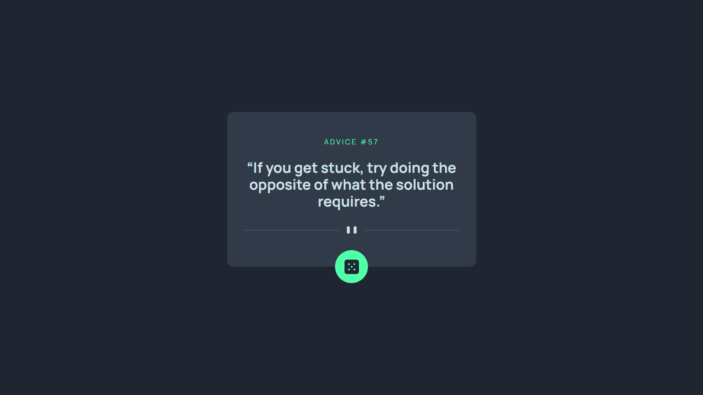
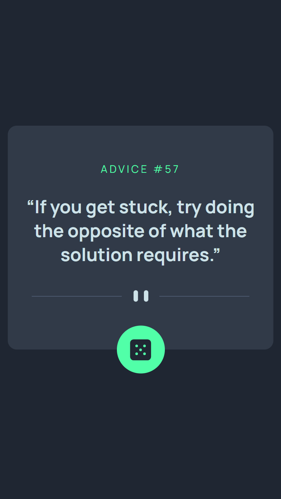

# Frontend Mentor - Advice generator app solution

This is a solution to the [Advice generator app challenge on Frontend Mentor](https://www.frontendmentor.io/challenges/advice-generator-app-QdUG-13db). Frontend Mentor challenges help you improve your coding skills by building realistic projects.

## Table of contents

- [Overview](#overview)
  - [The challenge](#the-challenge)
  - [Screenshot](#screenshot)
  - [Links](#links)
- [My process](#my-process)
  - [Built with](#built-with)
  - [What I learned](#what-i-learned)
  - [Useful resources](#useful-resources)
- [Author](#author)
- [Acknowledgments](#acknowledgments)

## Overview

### The challenge

Users should be able to:

- View the optimal layout for the app depending on their device's screen size
- See hover states for all interactive elements on the page
- Generate a new piece of advice by clicking the dice icon

### Screenshot

- Desktop version.  
  

- Mobile version.  
  

### Links

- Solution URL: [Source code on Github](https://github.com/Abaljerind/advice-generator-app)
- Live Site URL: [Advice Generator App](https://advice-generator-app-chi-six.vercel.app/)

## My process

### Built with

- Semantic HTML5 markup
- Flexbox
- Mobile-first workflow
- [React](https://reactjs.org/) - JS library
- [Vite](https://vite.dev/) - React framework

### What I learned

In this challenge I've learned to use useState and useEffect for displaying data from API. The useState is used to saved the data that have been fetched from API using handleGetQuote()

Below are the codes:

```html
<h1>Some codes I've learned</h1>
```

```js
const [quote, setQuote] = useState("");
const [quoteId, setQuoteId] = useState(null);

useEffect(() => {
  handleGetQuote();
}, []);
```

### Useful resources

- [TailwindCSS](https://tailwindcss.com/) - This helped me to do the styling more easy. I really liked this bootstrap and will use it going forward.
- [Vercel](https://vercel.com) - This is an amazing website which helped me to upload my website into the internet. I'd recommend it to anyone still learning to use this website.

## Author

- Frontend Mentor - [@Abaljerind](https://www.frontendmentor.io/profile/Abaljerind)
- Github - [@Abaljerind](https://github.com/Abaljerind)

## Acknowledgments

I want to thank me for believing in me, I want to thank me for doing all this hard work. I wanna thank me for having no days off. I wanna thank me for never quitting. I wanna thank me for being me at all times.
